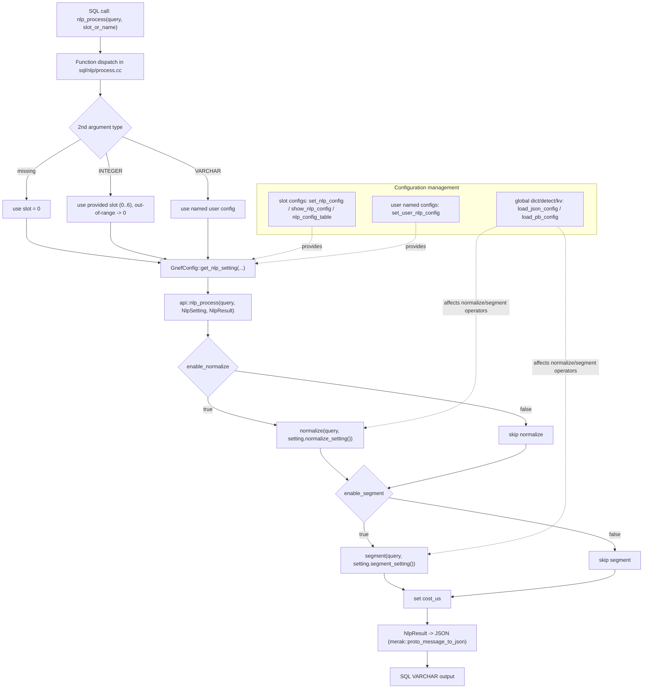

gnef
=============================

[中文版](./README_CN.md)

## First Principle: Expression Is Development

`gnef` is built on one core idea:
**stable expression defines development output and runtime behavior**.

In `gnef`, SQL is the expression layer for online NLP behavior:

- express intent with SQL
- bind semantics through IR/protocol
- execute safely in a production runtime

This is the core definition of SQL IR in this project.

## Why This Matters

As systems grow, engineering entropy grows faster:

- business rules scatter across services
- runtime behavior diverges across languages
- hotfixes become hidden, undocumented logic
- iteration speed drops while incident risk rises

`gnef` turns NLP processing into a declarative, contract-driven pipeline.
The result is higher iteration throughput, predictable behavior, and automation-ready interfaces.

## What gnef Is

`gnef` is a production NLP runtime and orchestration layer in the Kumose ecosystem.
It delivers stable online behavior through expression, contract, and runtime coordination.

Responsibilities are split on purpose:

- `gnef`: SQL control plane, runtime orchestration, online config, hot reload
- `nlpproto`: semantic contract and C++ protocol API
- plugin implementations: segmenter, detector, normalize, rewrite, NER, others

This separation keeps contracts stable and implementations replaceable.
It also makes runtime operations scriptable for AI skills and operator tooling.

## Expression-Driven Architecture

`gnef` uses a three-layer model:

- expression layer: SQL/API defines what should happen
- semantic layer: `nlpproto` defines what data means
- execution layer: operators and instances define how it runs

Result: faster iteration, controlled behavior, and deterministic change rollout.

## Multi-Layer API, One Contract

`gnef` supports multiple entry layers while preserving one semantic contract:

- SQL API for online orchestration and operations
- C++ API for low-level integration and explicit control
- Python binding for fast experimentation

All paths converge to `nlpproto` to prevent semantic drift.
This enables AI skills to operate the system through stable interfaces instead of custom per-service glue.

## Production Stability as a Core Feature

Stability is designed into runtime mechanics:

- double-buffered instance swap (`DoubleInstance`) for read/write isolation
- initialize-first then atomic pointer switch
- lock-light read path with consistent snapshots
- failed updates do not poison serving instances

With slot-based profiles, this enables low-risk online rollout, A/B testing, and rollback.

## SQL IR Example

```sql
select nlp_process('We are from Tsinghua University, and our supervisor is Yao Wenjun☺', 4);
```

The second argument is the **slot** selector:

- slot `0`: default strategy
- slot `1..6`: online experiment strategies
- out-of-range slot: fallback to default

This keeps invocation stable while strategies evolve.

## NLP Processing Flow (with Config Sources)

The flow below follows the real path of `nlp_process` in `sql/nlp/process.cc` and `api/nlp.cc`.
Configuration points are explicitly marked.



## Runnable SQL Examples

Initialize first, then call functions registered in `sql/**/registry.cc`:

```sql
pragma initialize_gnef_default;

select detect_lang('We are from Tsinghua University');
-- en

select normalize_default('We are from Tsinghua University, and our supervisor is Yao Wenjun☺');
-- {"query":"We are from Tsinghua University, and our supervisor is Yao Wenjun"}

select segment('我们来自清华大学，我们的导师是姚文君', true);
-- {"terms":[...]}

select nlp_process('We are from Tsinghua University, and our supervisor is Yao Wenjun☺', 4);
-- {"raw_query":...,"normalized":...,"terms":...,"cost_us":...}
```

The examples above were executed with `build/gnef/gnef` and match the current runtime behavior.

## Quick Start

```bash
cmake --preset=default
cmake --build build -j"$(nproc)"
./build/gnef/gnef
```

Then run:

```sql
pragma initialize_gnef_default;
select nlp_process('We are from Tsinghua University, and our supervisor is Yao Wenjun☺', 4);
```

## Build

The `default` preset in `CMakePresets.json` uses:

- generator: `Unix Makefiles`
- binary directory: `build`
- toolchain: `$env{KMPKG_CMAKE}`

### Requirements

- Linux (Ubuntu 20.04+ / CentOS 7+ recommended)
- CMake >= 3.24
- GCC >= 9.4 or Clang >= 12
- `kmpkg` installed and `KMPKG_CMAKE` configured

### Configure and Build

```bash
cmake --preset=default
cmake --build build -j"$(nproc)"
```

### Manual Mode

```bash
cmake -S . -B build
cmake --build build -j"$(nproc)"
```

Use `kmpkg` toolchain in manual mode:

```bash
cmake -S . -B build -DCMAKE_TOOLCHAIN_FILE="$KMPKG_CMAKE"
```

### Test

```bash
ctest --test-dir build
```

## Related Projects

- [goose](https://github.com/kumose/goose)
- [nlpproto](https://github.com/kumose/nlpproto)
- [kmdo](https://pub.kumose.cc/kmdo)
- [kmpkg](https://pub.kumose.cc/kmpkg)
- [kmcmake](https://pub.kumose.cc/kmcmake)

