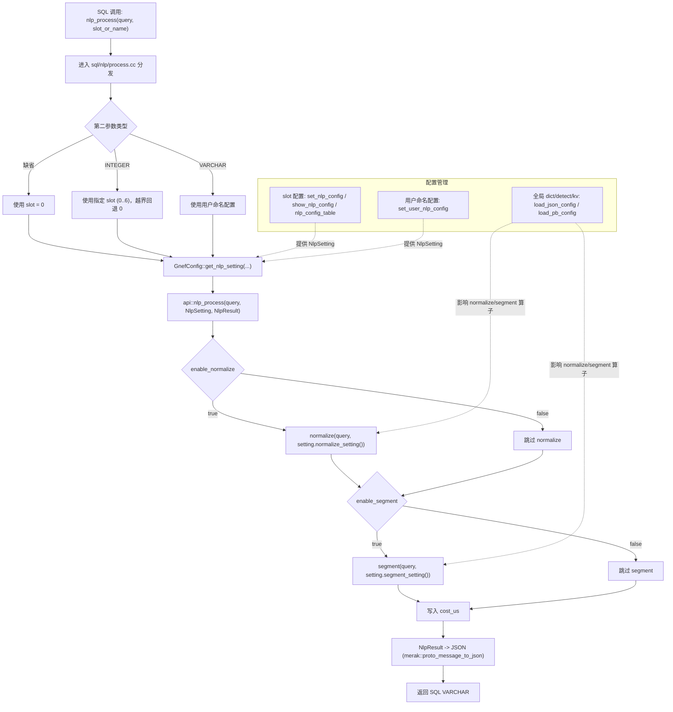

gnef
=============================

[English](./README.md)

## 第一性原理：表达即开发

`gnef` 的核心观点只有一句话：
**用稳定表达直接定义开发结果与运行行为。**

在 `gnef` 中，SQL 是线上 NLP 行为的表达层：

- 用 SQL 表达意图
- 用 IR/协议绑定语义
- 用运行时稳定执行

这就是本项目 SQL IR 的核心定义。

## 为什么这件事重要

系统规模扩大后，工程熵增会持续吞噬研发效率：

- 业务规则散落在不同服务
- 跨语言实现语义逐步漂移
- 线上临时修复难以追踪
- 迭代速度下降且风险上升

`gnef` 将 NLP 处理组织为声明式、契约化、可治理的执行体系。
结果是更高的迭代效率、更可控的系统行为、以及可自动化操作的接口形态。

## gnef 是什么

`gnef` 是 Kumose 体系中的生产级 NLP 运行时与编排层。
它通过表达层、契约层、执行层协同，持续提供线上稳定运行能力。

职责边界明确划分：

- `gnef`：SQL 控制面、运行时编排、在线配置、热更新
- `nlpproto`：语义契约与 C++ 协议 API
- 算法插件：分词、检测、标准化、改写、NER 等实现层

这种分层本质上是在治理工程熵增：上层契约稳定，下层实现可替换。
这套分层也让 AI skills 可以基于稳定接口进行自动操作与编排。

## 表达驱动架构

`gnef` 使用三层模型：

- 表达层：SQL/API 定义做什么
- 语义层：`nlpproto` 定义数据含义
- 执行层：operator/instance 定义如何执行

结果是：迭代提效、行为可控、变更可审计与可回滚。

## 多层 API 协同，一套语义契约

`gnef` 支持多层调用，但语义保持一致：

- SQL API：在线编排、A/B 实验、运维控制
- C++ API：低开销、强控制接入
- Python binding：快速试验与脚本化开发

三层最终都收敛到 `nlpproto`，降低跨语言语义偏差。
这使 AI skills 可直接面向统一接口执行操作，而不依赖临时胶水逻辑。

## 生产稳定性是内建能力

`gnef` 采用控制面与数据面分离：

- SQL 控制面：声明式调用与运行切换
- NLP IR 数据面：`nlpproto` 结构化输入输出
- 执行面：operator + instance 安全替换

热更新机制是运行时内建能力：

- 双缓冲实例容器（`DoubleInstance`）实现读写隔离
- 先初始化新实例，再原子切换指针
- 读路径保持一致快照，低扰动
- 更新失败不污染线上服务实例

叠加 slot 配置后，可实现低风险灰度、A/B 与回滚。

## SQL IR 示例

```sql
select nlp_process('我们来自清华大学，我们的导师是姚文君☺', 4);
```

第二个参数是**槽位（slot）**选择器：

- slot `0`：默认策略
- slot `1..6`：在线实验策略
- 越界 slot：回退默认策略

这样可以保持调用稳定，同时持续演进策略。

## NLP 处理流程（标注配置管理来源）

下图对应 `sql/nlp/process.cc` 与 `api/nlp.cc` 的真实执行路径，并标注了配置来源。



## 可直接运行的 SQL 示例

先初始化，再调用 `sql/**/registry.cc` 中注册的函数：

```sql
pragma initialize_gnef_default;

select detect_lang('We are from Tsinghua University');
-- en

select normalize_default('We are from Tsinghua University, and our supervisor is Yao Wenjun☺');
-- {"query":"We are from Tsinghua University, and our supervisor is Yao Wenjun"}

select segment('我们来自清华大学，我们的导师是姚文君', true);
-- {"terms":[...]}

select nlp_process('We are from Tsinghua University, and our supervisor is Yao Wenjun☺', 4);
-- {"raw_query":...,"normalized":...,"terms":...,"cost_us":...}
```

以上示例已通过 `build/gnef/gnef` 实际执行，和当前运行时行为一致。

## 快速开始

```bash
cmake --preset=default
cmake --build build -j"$(nproc)"
./build/gnef/gnef
```

然后执行：

```sql
pragma initialize_gnef_default;
select nlp_process('我们来自清华大学，我们的导师是姚文君☺', 4);
```

## Build

`CMakePresets.json` 中 `default` preset 当前配置：

- 生成器：`Unix Makefiles`
- 构建目录：`build`
- 工具链：`$env{KMPKG_CMAKE}`

### 环境要求

- Linux（推荐 Ubuntu 20.04+ / CentOS 7+）
- CMake >= 3.24
- GCC >= 9.4 或 Clang >= 12
- 已安装 `kmpkg` 且 `KMPKG_CMAKE` 可用

### 配置与编译

```bash
cmake --preset=default
cmake --build build -j"$(nproc)"
```

### 手动模式

```bash
cmake -S . -B build
cmake --build build -j"$(nproc)"
```

手动模式下使用 `kmpkg` 工具链：

```bash
cmake -S . -B build -DCMAKE_TOOLCHAIN_FILE="$KMPKG_CMAKE"
```

### 测试

```bash
ctest --test-dir build
```
